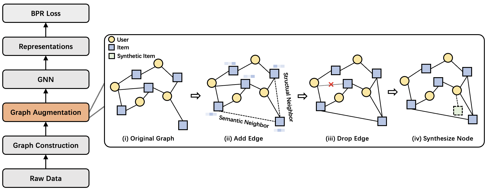

# Improving Long-Tail Item Recommendation with Graph Augmentation

This is the PyTorch implementation for RecRanker model.

> **Improving Long-Tail Item Recommendation with Graph Augmentation.**  
Sichun Luo, Chen Ma, Yuanzhang Xiao, and Linqi Song.  
*CIKM2023*

---

## Introduction
In this paper, we propose a novel approach, {\textbf{G}raph \textbf{A}ugmentation for \textbf{Lo}ng-tail \textbf{Re}commendation (**GALORE**)}, which can be plugged into any graph-based recommendation models to improve the performance for tail items. GALORE incorporates an edge addition module that enriches the graph's connectivity for tail items by injecting additional item-to-item edges. To further balance the graph structure, GALORE utilizes a degree-aware edge dropping strategy, preserving the more valuable edges from the tail items while selectively discarding less informative edges from the head items. Beyond structural augmentation, 
we synthesize new data samples, thereby addressing the data scarcity issue for tail items. We further introduce a two-stage training strategy to facilitate the learning for both head and tail items.

## Citation
If you find RecRanker useful in your research or applications, please kindly cite:

> @inproceedings{luo2023improving,  
  title={Improving long-tail item recommendation with graph augmentation},  
  author={Luo, Sichun and Ma, Chen and Xiao, Yuanzhang and Song, Linqi},  
  booktitle={Proceedings of the 32nd ACM International Conference on Information and Knowledge Management},  
  pages={1707--1716},  
  year={2023}. 
}

Thanks for your interest in our work!

## Acknowledgement
The structure of this code is largely based on [SELFRec](https://github.com/Coder-Yu/SELFRec). Thank them for their work.
